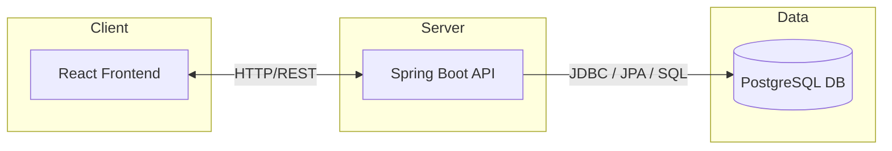
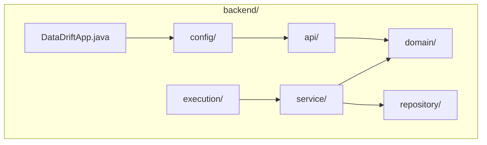
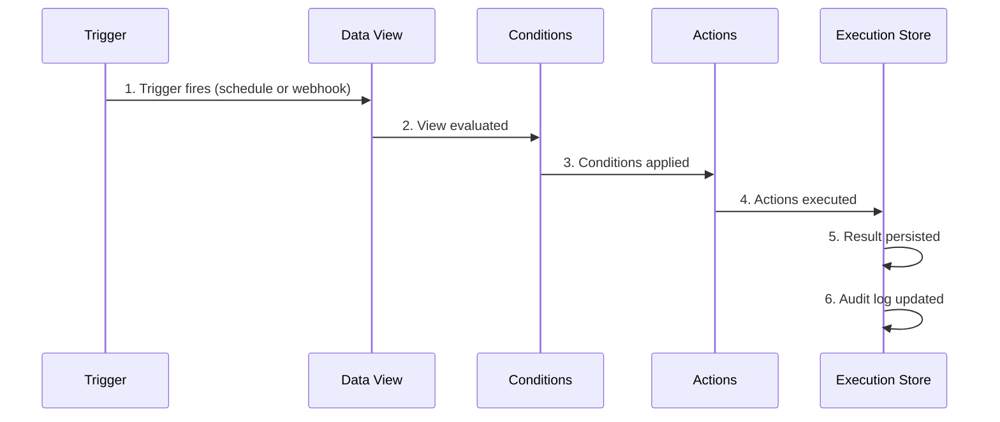

# DataDrift Architecture

## Overview

DataDrift is a **single-tenant**, **locally deployable** data monitoring and automation platform. It connects to external data sources (files, APIs, databases), exposes them as queryable tables, and executes automation rules based on detected data conditions.

The architecture is intentionally simple, modular, and local-first, optimized for:

- Fast local development
- Deterministic behavior
- Strong observability
- Incremental feature growth

DataDrift is designed to run as a **single application process** backed by PostgreSQL, with no external cloud dependencies required.

---

## High-Level Architecture

| Layer        | Component      | Protocol        |
| ------------ | -------------- | --------------- |
| Client       | React Frontend | HTTP/REST       |
| Server       | Spring Boot API| —               |
| Data         | PostgreSQL DB  | JDBC / JPA / SQL|

---

## Architectural Principles

### 1. Single-Tenant by Design

Each DataDrift deployment serves exactly one tenant. There is no tenant isolation logic, schema partitioning, or per-tenant routing.

### 2. Local-First Execution

The system is optimized to run on a developer machine or private server with predictable performance and no hidden remote dependencies.

### 3. Explicit Over Implicit

All automation behavior is defined declaratively via stored rule definitions. There is no “magic” background behavior.

### 4. Thin UI, Strong Backend

The backend owns business logic, validation, and execution. The frontend is a presentation and orchestration layer only.

### 5. Composable Data Model

Data sources, views, rules, executions, and templates are separate but composable concepts.

---

## Backend Architecture

### Technology Stack

| Category   | Choices                          |
| ---------- | -------------------------------- |
| Language   | Java 21                          |
| Framework  | Spring Boot                      |
| Build      | Maven                            |
| Runtime DB | PostgreSQL (Dockerized)          |
| Test DB    | H2 (in-memory)                   |
| Persistence| JPA / Hibernate                  |

### Module Structure

| Path              | Purpose                          |
| ----------------- | -------------------------------- |
| `api/`            | REST controllers and DTOs        |
| `domain/`         | Core domain models               |
| `service/`        | Business logic                   |
| `repository/`     | Persistence interfaces           |
| `execution/`      | Automation runtime & schedulers  |
| `config/`         | Spring and infrastructure config |
| `DataDriftApp.java` | Application entry point        |

---

## Core Domains

### Data Source

Represents an external system or file location.

**Examples:**

- CSV file path
- JSON file path
- REST API endpoint + headers
- External database connection

> Data sources are **configuration only** and do not store data internally.

---

### Data View

A logical table definition built on top of a data source.

- Defined by selected fields or SQL query
- Read-only
- Evaluated at runtime

Views act as the **primary input** for automation rules.

---

### Automation Rule

Defines when and how actions should execute.

A rule consists of:

| Part        | Description                    |
| ----------- | ------------------------------ |
| **Trigger** | Schedule or webhook            |
| **Conditions** | SQL or field comparisons   |
| **Actions** | Notifications, webhooks, reports |

Rules are stored as structured JSON and interpreted by the execution engine.

---

### Execution

Represents a single run of an automation rule.

**Tracks:**

- Start and end time
- Execution status (success / failure)
- Error details
- Generated outputs

Executions form the basis of **audit logging and observability**.

---

### Templates

Reusable content definitions for:

- Emails
- Reports
- Notifications

Templates are parameterized and resolved during rule execution.

---

## Frontend Architecture

### Technology Stack

- **React**
- **TypeScript**
- Modern component-based architecture

### Responsibilities

- Configuration UI
- Rule creation and testing
- Execution monitoring
- Report viewing

The frontend communicates **exclusively** with the backend via REST APIs.

---

## Automation Execution Flow

1. **Trigger** fires (schedule or webhook)
2. **Data view** is evaluated
3. **Conditions** are applied
4. **Actions** are executed
5. **Execution result** is persisted
6. **Audit log** is updated

---

## Development & Dev Loop

- Single-command development via **ddmake**
- Backend and frontend run together locally
- PostgreSQL provided via Docker
- H2 used for tests only

---

## Non-Goals (Explicit)

- Multi-tenancy
- Cloud-managed hosting
- Real-time streaming
- End-user scripting

---

## Future Extensions (Planned)

- Plugin system
- Additional data connectors
- Advanced scheduling strategies
- Exportable execution artifacts

---

*This document is intentionally high-level and will evolve as DataDrift matures.*
